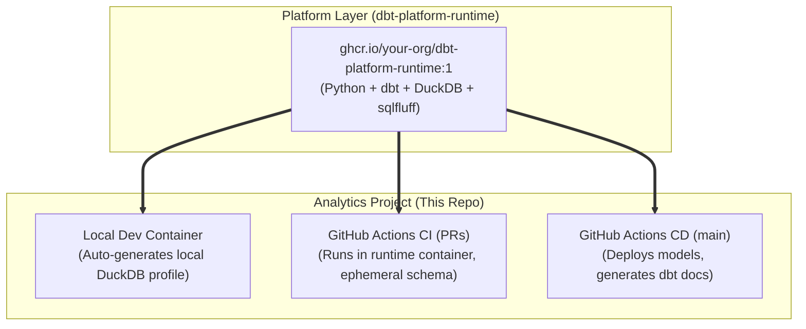

# E-Commerce dbt Analytics

An analytics engineering project showcasing **Immutable CI/CD**, **12-Factor Configuration**, and **Dev Containers** powered by the central platform image built in [`dbt-platform-runtime`](../dbt-platform-runtime/).

---

## Architecture Overview



---

## Key Highlights

1. **Immutable Environment (Zero Installation at Runtime):**
   - This repository contains **no Dockerfiles, no pip installs, and no python setup steps**.
   - Both the local Dev Container and the CI/CD pipelines run inside the pre-baked, immutable container published by `dbt-platform-runtime`.
2. **12-Factor Profile Injection:**
   - No database credentials or environment topologies are hardcoded into Git.
   - The environment dynamically injects the appropriate `~/.dbt/profiles.yml`:
     - **Local Dev:** Auto-configured to write to local `dev.duckdb`.
     - **CI (Pull Requests):** Auto-configured to write to an isolated schema: `pr_<PR_NUMBER>`.
     - **CD (Production):** Auto-configured to write to production `analytics_prod`.
3. **Automated Governance & Gates:**
   - Pull Requests automatically trigger SQLFluff linting and dbt data testing.
   - Merges to `main` trigger automated production releases and documentation generation.

---

## Local Development (Quickstart)

### Using Dev Containers (Recommended)
1. Open this repository in VS Code or Google Antigravity with the **Dev Containers** extension installed.
2. Click **Reopen in Container**.
3. The environment will initialize with all tools (`dbt`, `sqlfluff`, extensions) ready to use.
4. Run:
   ```bash
   make build
   ```

### Available Make Commands

```bash
make help    # List all available targets
make lint    # Run SQLFluff against models/
make seed    # Load CSV seeds into DuckDB
make run     # Build SQL models
make test    # Run dbt data tests
make build   # Full cycle: lint + seed + run + test
make docs    # Generate and serve interactive dbt documentation on port 8080
```
